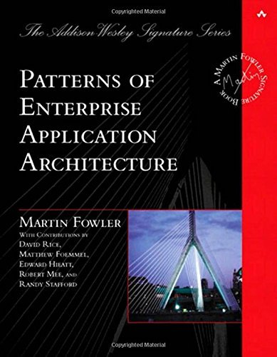
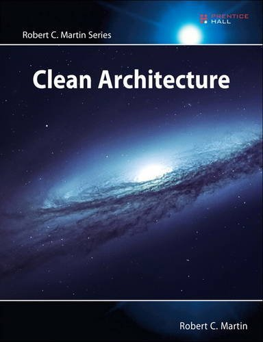
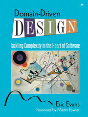
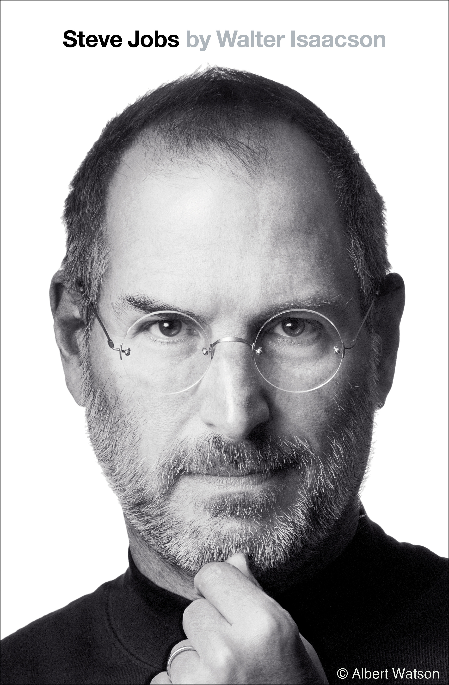
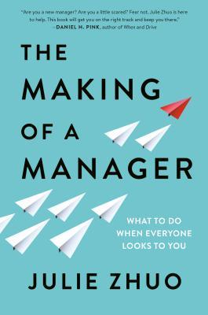

## Favourite Software Books

[Patterns of Enterprise Application Architecture](https://www.goodreads.com/book/show/70156.Patterns_of_Enterprise_Application_Architecture) - Martin Fowler

[Clean Architecture](https://www.goodreads.com/book/show/18043011-clean-architecture) - Robert Martin

[Domain Driven Design](https://www.goodreads.com/book/show/179133.Domain_Driven_Design) - Eric Evans

[Greenlights](https://www.goodreads.com/book/show/52838315-greenlights) - Matthew McConaughey

[Steve Jobs](https://www.goodreads.com/book/show/11084145-steve-jobs) - Walter Isaacson

[The Making of a Manager](https://www.goodreads.com/book/show/38821039-the-making-of-a-manager) - Julie Zhuo

